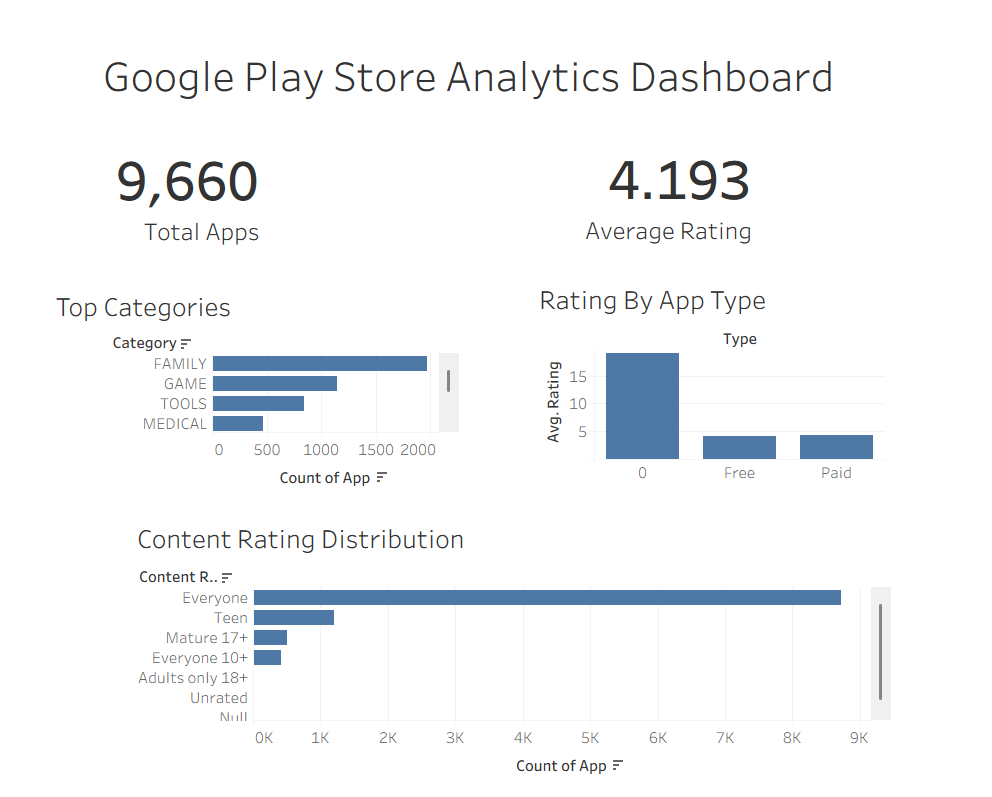

# 📱 Google Play Store Analytics Dashboard

## 📌 Project Overview

This project analyzes the Google Play Store dataset to uncover trends in app categories, ratings, content ratings, and app types. The dataset was cleaned using Python (Pandas) and visualized using Tableau to create an interactive dashboard for business insights.

The objective of this project is to demonstrate data cleaning, exploratory data analysis, and dashboard development skills using real-world data.

---

## 📊 Dashboard Preview



---

## 🎯 Project Objectives

- Analyze the Google Play Store dataset.
- Clean and preprocess raw data using Python.
- Identify the most popular app categories.
- Compare ratings between Free and Paid apps.
- Analyze content rating distribution.
- Build an interactive Tableau dashboard.

---

## 🛠️ Tools & Technologies

- Python
- Pandas
- NumPy
- Jupyter Notebook
- Tableau
- Git
- GitHub

---

## 📂 Project Structure

```
Google-Play-Store-Analytics/
│
├── data/
│   ├── raw/
│   └── cleaned/
│
├── notebooks/
│   └── 01_Data_Cleaning.ipynb
│
├── tableau/
│   ├── Google_Play_Store_Analytics.twb
│   └── dashboard.png
│
├── README.md
└── requirements.txt
```

---

## 📈 Dashboard Highlights

### KPI Cards
- Total Apps
- Average Rating

### Visualizations
- Top Categories
- Rating by App Type
- Content Rating Distribution

---

## 🧹 Data Cleaning

The dataset was cleaned using Python by:

- Handling missing values
- Removing duplicate records
- Cleaning the **Installs** column
- Correcting invalid values
- Converting data types
- Exporting a cleaned dataset for Tableau

---

## 📌 Key Insights

- The dataset contains **9,660** Google Play Store applications.
- The average app rating is approximately **4.19**.
- Family and Game are among the largest app categories.
- Free applications dominate the Play Store.
- Most applications are rated suitable for **Everyone**.

---

## 🚀 Skills Demonstrated

- Data Cleaning
- Exploratory Data Analysis (EDA)
- Data Visualization
- Dashboard Design
- Business Insight Generation
- Tableau Dashboard Development

---

## 👨‍💻 Author

**Irfan Ahmed S**

GitHub: https://github.com/IrfanAhmed157

LinkedIn: www.linkedin.com/in/irfan-ahmed-s-1133b8296
